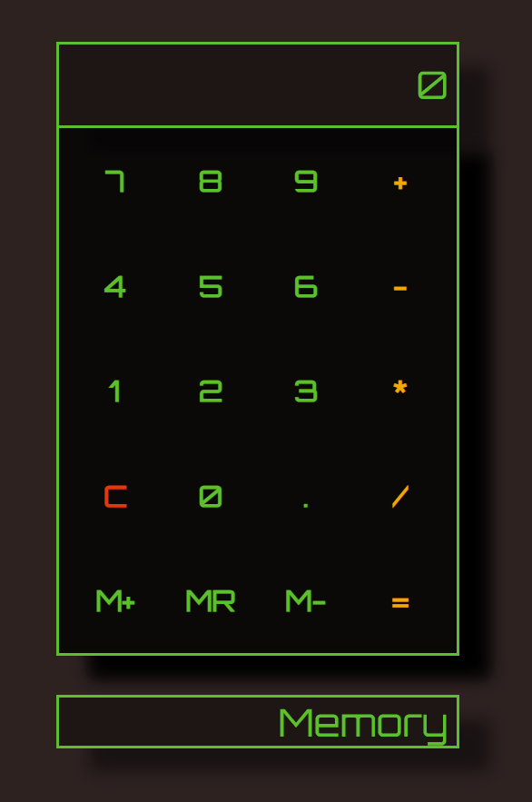

# Vanilla JavaScript Calculator

  ### Fully functional Calculator developed in HTML/CSS/JavaScript
  

 ## Summary
 This was far more intricate than expected. There were a lot of obstacles to overcome to get the display to function properly (show digits in the correct order, 
 leave number on the screen until next number is entered, etc). Functionality was added for both clicking and keyboard entry methods. For this project, I also spent
 more time on design to make it attractive and functional.
 
  ### Try it live [here](https://codepen.io/bcham16/pen/WNMKZPX)
 
 ##Author
 Brandon Chamberlain - Apprentice Software Developer | [LinkedIn](https://www.linkedin.com/in/bchamberlain3618/) | 
 [Personal Website](https://www.thebrandonchamberlain.com)
